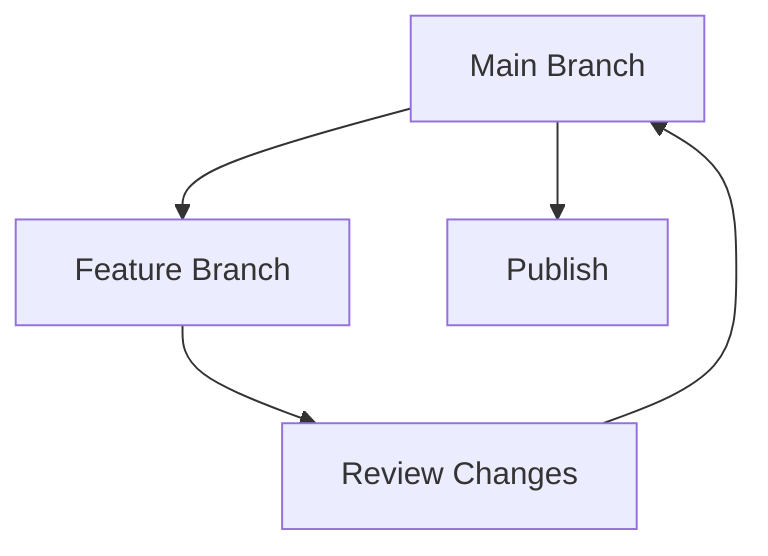

## Overview

Alves Redol Café provides powerful tools to create, manage, and collaborate on your project documentation. You streamline workflows with intuitive editing, version tracking, team sharing, and smart search. These features help you maintain organized, up-to-date docs that scale with your projects.

<Columns cols={2}>
  <Card title="Document Creation" icon="edit-3" href="#document-creation">
    Build rich documents with Markdown support and live previews.
  </Card>
  <Card title="Version Control" icon="git-branch" href="#version-control">
    Track changes like Git with branching and merge capabilities.
  </Card>
  <Card title="Collaboration" icon="users" href="#collaboration">
    Invite teams, review edits, and share securely.
  </Card>
  <Card title="Search & Organization" icon="search" href="#search-organization">
    Find content instantly and structure docs hierarchically.
  </Card>
</Columns>

## Document Creation and Editing

Create new documents directly in the dashboard. You access a full-featured Markdown editor with syntax highlighting, live preview, and auto-save.

<Steps>
  <Step title="Start a New Doc" icon="plus">
    Click the `New Document` button and select a template.
  </Step>
  <Step title="Edit Content">
````markdown
# Welcome to Alves Redol Café

## Quick Start

Install via npm:

```bash
npm install alves-redol-cafe
```

Configure your `{API_KEY}` in `config.json`.
````
  </Step>
  <Step title="Preview and Publish" icon="eye">
    Toggle preview mode and hit `Publish` to make it live.
  </Step>
</Steps>

<Callout kind="tip">
  Use keyboard shortcuts like `Ctrl + B` for bold and `Ctrl + K` for links to speed up editing.
</Callout>

## Version Control for Docs

Maintain history with built-in version control. You create branches, commit changes, and merge updates without external tools.



<CodeGroup tabs="CLI,UI">
````bash
# Create and switch to branch
arc branch feature/docs-update
arc commit -m "Add collaboration guide"
arc push
````

````jsx
// In dashboard UI
// 1. Click Branches > New Branch
// 2. Edit file
// 3. Create Pull Request > Merge
````
</CodeGroup>

## Collaboration and Sharing Options

Invite team members and control access levels. You share docs publicly or privately with fine-grained permissions.

<Tabs>
  <Tab title="Team Invite" icon="mail">
    Send invites via email or link. Roles include Viewer, Editor, Admin.
  </Tab>
  <Tab title="Share Links" icon="link">
    Generate shareable links with expiration or password protection.
  </Tab>
  <Tab title="Review Workflow" icon="git-pull-request">
    Use comments and `@mentions` for feedback.
  </Tab>
</Tabs>

## Search and Organization Features

Organize docs into folders and tags. Advanced search indexes content for instant results.

<Expandable title="Advanced Search Filters" default-open="false">
  Filter by tags, date, or author. Example query: `collaboration since:2024-01-01 tag:guide`.
</Expandable>

| Feature | Description | Example |
|---------|-------------|---------|
| Folders | Nested hierarchies | `/projects/api/v1/` |
| Tags | Cross-reference | `#feature`, `#bugfix` |
| Full-Text Search | Keyword matching | `Search "version control"` |

<Callout kind="info">
  Tag docs consistently to unlock powerful filtering and analytics.
</Callout>

These core features empower you to build professional documentation efficiently. Start with document creation and explore collaboration next.